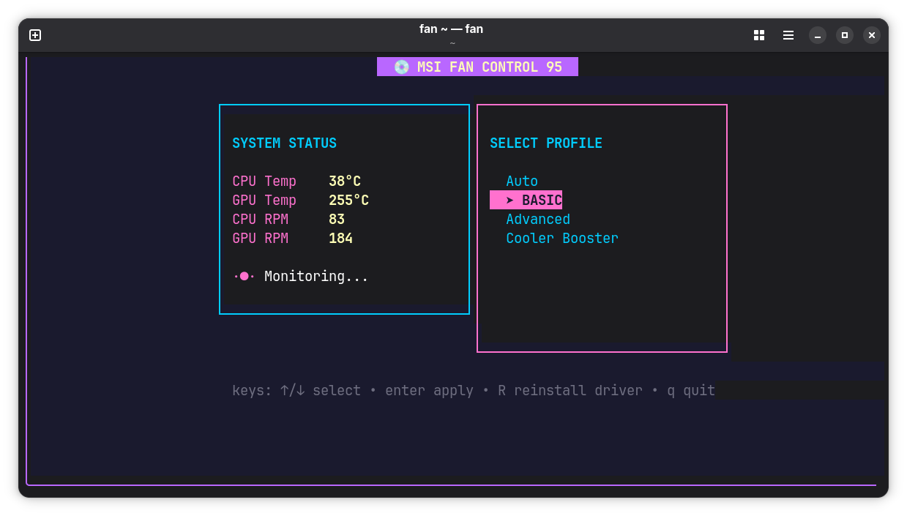

<div align="center">


**Fan control TUI for MSI laptops on Linux.**

[**Report Bugs**](https://github.com/junevm/msifancontrol/issues) | [**Releases**](https://github.com/junevm/msifancontrol/releases) | [**Contributing**](#-contributing) | [**License**](#-license)

</div>

`msifancontrol` is a Terminal User Interface (TUI) for managing fan speeds on MSI laptops. It provides direct access to the Embedded Controller (EC), allowing for custom fan curves, basic profiles, and "Cooler Boost" mode—all wrapped in a dreamy 90s vaporwave aesthetic.

### Screenshot



### Features

- ⚡ **Auto-Elevation**: Prompts for sudo only when needed to access `/dev/port`.
- 📊 **Multiple Profiles**: Support for Auto, Basic, Advanced (custom curves), and Cooler Boost.
- 🎨 **Beautiful TUI**: Built with Bubble Tea and Lip Gloss for a high-quality terminal experience.
- 🛠️ **Auto-Setup**: Helper scripts to ensure kernel modules like `ec_sys` are correctly configured.

### Supported Models

Tested primarily on the **MSI GF65 Thin 9SD**.

> [!WARNING]
> Writing to the EC memory can be dangerous. While this tool uses well-known offsets for MSI laptops, ensure your model is compatible before use.

## 🚀 Installation

### Option 1: Install Script (Recommended)

The easiest way to install the latest release is via our installer script:

```bash
curl -sfL https://raw.githubusercontent.com/junevm/msifancontrol/main/install.sh | sh
```

### Option 2: Go Install

If you have Go installed:

```bash
go install github.com/junevm/msifancontrol/cmd/fan@latest
```

### Option 3: Homebrew (Linux)

```bash
brew tap junevm/msifancontrol-tap
brew install msifancontrol
```

### Option 4: Manual Download

Download the latest binary for your architecture from the [Releases](https://github.com/junevm/msifancontrol/releases) page.

## 💻 Usage

Run the tool with sudo privileges (the app will attempt to self-elevate if run as a normal user):

```bash
msifancontrol
```

## 🤝 Contributing

Contributions are welcome!

1. Fork the Project
2. Create your Feature Branch (`git checkout -b feature/AmazingFeature`)
3. Commit your Changes (`git commit -m 'Add some AmazingFeature'`)
4. Push to the Branch (`git push origin feature/AmazingFeature`)
5. Open a Pull Request

## 📄 License

See [LICENSE](./LICENSE) for details.
